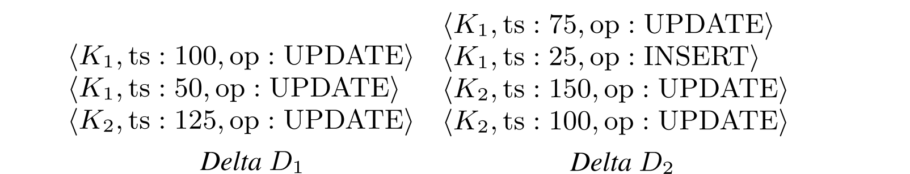

# CMU-15721

## 01

### 关系型数据库

### 面向对象的数据库

* JSON、XML

### OLAP数据库

* 在行存上做数据分析是一个bad idea
* 特点
  * 分布式/shared nothing
  * 关系型/SQL
  * 列存
  * Parallel column store data warehouse
* Mapreduce: hadoop hive spark(类似)

### NoSQL

* 目标：高可用、高扩展
* 特点：
  * Schemaless
  * Non-relational(document、 kv 、column-family)
  * No ACID transactions
  * Custom APIs instead of SQL
* hbase、 redis、 mongodb

### NewSQL

* 目标：在不放弃ACID的前提下，为OLTP负载提供与NoSQL相同的性能
* 特点：
  * 分布式
  * 关系型/SQL
* Google spanner、TiDB

### 云

* database-as-a-service、云原生
* snowflake

### Shared-DISK engines

* 云供应商管理存储
* 特点
  * 将执行层从存储中独立出来
  * favors log-structured approaches
* data lake

### 图系统

* 提供以图形为中心的查询API
* 2023年有文章验证了关系型数据库的性能可以超过图数据库（neo4j的10倍）

### 时序系统

* 为 时序数据 和 event data 设计
* 限定了 数据分布 和 查询模式
* Influxdb、clickhouse

### 区块链数据库

* Decentralized distributed log with incremental checksums (Merkle Trees)

## 02

### 分布式查询执行

在分布式DBMS中执行OLAP查询，与在单节点DBMS中执行OLAP查询大致相同

<figure><figcaption>
分布式查询执行示意图
</figcaption></figure>

#### **数据类别**

Persistent Data

* 源数据
* 一般不可以原地更新，而是append

Intermediate Data

* 中间数据
* 一个查询所产生的中间数据的数量与它所读取的持久性数据量或执行时间几乎没有任何关联
* 最好能存在内存

### 分布式结构 in OLAP

决定了数据存储位置。这将影响节点之间的协作方式，以及它们在数据库中检索/存储对象的位置

#### **两种方式**

1. Push Query to Data
   * 尽量将查询/计算下推到存储数据的节点
   * 在网络传输之前，在数据所在的节点尽可能多地进行过滤和处理
   * 在数据存储节点执行部分查询的代价 < 数据传输的代价
2. Pull Data to Query
   * 将数据带到正在执行查询的节点上
   * 这在数据存储节点上没有计算资源时，是必要的
   * 硬件发展迅速，网络加速，这也许是一个好方法

#### **Shared nothing**

* 每个数据库实例都拥有自己的cpu、内存、磁盘；相互之间通过网络进行通信
* 增加一个节点，需要在节点之间物理地移动数据
* dbms可以通过 POSIX API访问本地数据

#### **Shared disk**

* 每个节点都访问一个单一的逻辑磁盘，但是每个节点持有自己的cpu和内存
* Instead of a POSIX API, the DBMS accesses disk using a userspace API.（比如云对象存储提供的用户API）

#### **比较**

* Shared nothing
  * 扩容难（需要移动数据）
  * 潜在的好性能和高效率
  * 在数据传输之前先过滤
* Shared disk（本课程后续主要关注对象）
  * 计算层扩展，可以独立于存储层
  * 容易关闭闲置的计算层资源
  * 可能需要在过滤之前，将持久数据从存储层拉到计算层
  * 云对象存储是现代OLAP DBMS的主流存储目标，因为可以“无限”扩展

#### **Object store**

* 将数据库的表（持久数据）分割成大的、不可改变的文件，存储在一个对象存储中
* 一个tuple的所有属性都以列存的方式存储在同一个文件中（PAX格式）
* header包含列的偏移量、压缩方案、索引和区域图等元数据
* DBMS检索一个块的header以确定它需要检索哪些字节范围（只检索需要的小部分数据，不用读入整个块）
* Eg: Yellowbrick

#### **additional topics**

* file format
* table partitioning
* data ingestion/updates/discovery
* Scheduling/adaptivity

### OLAP组件

andy认为没必要从零开始实现一个数据库，分为组件并开源化是值得尝试的趋势

#### **SYSTEM CATALOGS**

跟踪数据库schema

* HCatalog、Google Data Catalog、Amazon Glue Data Catalog

#### **QUERY OPTIMIZERS**

基于启发式和基于成本的查询优化

* DBMS提供转换规则和成本估算
* framework返回一个逻辑或物理查询计划
* Greenplum Orca、 Apache Calcite

#### **FILE FORMATS**

大多数DBMS使用专有的磁盘上的二进制文件。这样的话，不同系统之间需要将数据转为通用的基于文本的格式，如：CSV、JSON、XML等

* Apache Parquet、Apache Iceberg、Apache ORC、HDF5、Apache Carbon Data、Apache Arrow

#### **EXECUTION ENGINES**

列存数据库上的向量化执行、流数据查询处理

* Velox、DataFusion、Intel OAP

## **03**

### STORAGE MODELS

这里假设数据库是生成并组织这些数据，然而实际ap环境中，数据大多不是由当前数据库生成的

#### **Nary Storage Model (NSM)**

* 行存
* 适合OLTP：单个实体的访问和更新
* Use the tuple-at-a-time iterator processing model（火山模型）
* NSM数据库的页面大小通常是4KB硬件页的倍数

这里每行数据前的小header表示该行数据中是否有null等信息，并不存储该表的schema；而每个page前面的header可能会存储校验和，数据库版本等信息

<figure><figcaption>
NSM示意图
</figcaption></figure>

**优缺点**

* 优点
  * 更快的插入、更新和删除
  * 适合需要整个tuple数据的查询
  * 适合聚簇索引（如b树上叶子节点直接存储tuple）
* 缺点
  * 不合适扫描表属性的子集
  * 在访问模式上有糟糕的内存定位（读到内存的数据需要跳跃访问，而不是连续访问）
  * 不利于数据压缩

#### **Decomposition Storage Model (DSM)**

* 列存
* 适合OLAP；涉及部分表属性的大规模扫描只读查询
* Use a batched vectorized processing model（向量化执行）
* 文件大小更大，但文件内划分为groups
* 文件内通常用偏移量来识别tuple，对于变长数据要额外处理(字典压缩)

每个属性都有一个单独的文件，header存放该列的元数据，bitmap用来标记null值（虽然列中会为null的tuple保留空间）

<figure><figcaption>
DSM示意图
</figcaption></figure>

**列存和行存在寻址tuple上的区别**

* 行存：page id + slot offset
* 列存：列中的 offset

**DSM内部的元组识别**

* offsets：直接用偏移量
* embedded ids：列中每个值前面，都存放对应的tuple id

<figure><figcaption></figcaption></figure>

**变长数据的处理：**直接填充为定长，太浪费；字典压缩，将变长数据转为定长（适合重复数据较多）

**优缺点**

* 优点
  * 减少IO次数，因为减少了冗余数据的读取
  * 更快的查询速度，因为增加了局部性和cache数据的重复利用
  * 更高效的数据压缩
* 缺点
  * 不适合点查、插入、更新、删除，因为元组需要分裂/重组等操作

#### **Hybrid Storage Model (PAX)**

* 仍旧将表属性分开存储，但是希望一个tuple的数据在物理上尽量靠近
* 在数据库页内垂直化分属性， 既想要列存在查询上的速度优势，又想要行存tuple数据空间局部性的优势
* 水平分区，分为若干个行组
* global header包含行组的偏移量；每个行组都有自己的header，存储该行组的相关内容，如压缩方法等信息

<figure><figcaption>
PAX示意图
</figcaption></figure>

#### TRANSPARENT HUGE PAGES (THP)

更大更集中的页面可以减少TLB的条目数量

这项技术意味着操作系统会自动管理数据库正在使用的内存，从而大概率导致数据库访问内存时发生停顿（因为虚拟地址到物理地址的映射关系可能正在发生改变）

过去大部分DBMS建议关闭这项技术，但是谷歌最近的研究表明，开启THP会带来某些优化

### DATA REPRESENTATION

#### 浮点数

对于数据精度要求很高的话，需要使用**固定精度浮点数**，这类数据类型是由数据系统实现的，而不是硬件实现

Example: Store in an exact, variable-length binary representation with additional meta-data

#### **null**

1. Special Values：用特殊值代表NULL
2. Null Column Bitmap Header：用位图记录NULL位置
3. Per Attribute Null Flag：为每个值存储一个flag，导致的空间浪费不仅仅是1bit，因为要保证字对齐

### HYBRID STORAGE MODEL

**经验：**数据在刚刚进入数据库时是“hot”的，因为这时数据可能短期内再次被修改；但是经过一段时间之后，这份数据可能仅仅在只读查询中和其他tuple一起被扫描

这种需求引申出了**混合存储模型**：

* 使用单独的执行引擎，分别对NSM或DSM数据库进行优化
* 将新的数据存储在NSM中以实现快速的OLTP（热数据行存）
* 将数据迁移到DSM以获得更高效的OLAP（冷数据列存）
* 将两个引擎的查询结果结合起来，显示为统一的逻辑数据库

#### FRACTURED MIRRORS

以行存为主要数据，列存从行存中copy，列存可以崩溃，但是行存不行

所有的更新先进入NSM，最终复制到DSM镜像

<figure><figcaption>
FRACTURED MIRRORS 示意图
</figcaption></figure>

#### DELTA STORE

在NSM table中暂存热数据

后台线程将updates从delta store中向DSM中迁移和应用（批量处理大块的内容，然后写为PAX文件）（andy在模糊DSM和PAX，因为大部分列存都是PAX）

某个元组最新版本的数据只能来自于NSM或DSM（应用到列存就删除行存对应数据，以防空间浪费）

事务型操作面向行存；分析型查询可能需要行存和列存进行配合

<figure><figcaption>
DELTA STORE 示意图
</figcaption></figure>

### DATABASE PARTITIONING

Split database across multiple resources（以期获得并行上的优势）

* Disks, nodes, processors.&#x20;
* Often called "sharding" in NoSQL systems.

数据库在每个分区上执行部分查询，最终合成结果

DBMS可以在物理上 （shared nothing）或逻辑上（shared disk），对数据库进行分区

#### HORIZONTAL PARTITIONING

基于一些key和scheme，将表的tuples分割成互不相干的子集。

* 选择某一列的值，将数据库在大小、负载等方面进行平均划分

分区方案

* Hashing
* Ranges
* Predicates

<figure><figcaption>
水平分区示意图
</figcaption></figure>

#### LOGICAL PARTITIONING

<figure><figcaption>
逻辑分区示意图
</figcaption></figure>

#### PHYSICAL PARTITIONING

<figure><figcaption>
物理分区示意图
</figcaption></figure>

#### PARTING THOUGHTS

* 现代OLAP数据库基本都在使用PAX的变体，<mark style="color:red;">**PAX**</mark>的重点是数据是<mark style="color:red;">**定长**</mark>**的，以支持**<mark style="color:red;">**offset addressing**</mark>
* 虽然现实世界的表格中数字居多，但是数据库存储中占据空间的是字符串数据
* 现代列存系统运行很快，以至于人们不会对数据仓库的格式进行反规范化（对于DBA设计scheme的需求不再那么强烈）

## 04

### AP索引与连续扫描

#### AP索引与TP索引的区别

* TP使用索引来查找单个tuple，而不进行连续扫描（适合低选择性的谓词；小数量tuple的查询）
* TP索引需要支持数据增量更新
* TP底层更多是行存
* AP索引不需要支持单个tuple的查询，通常是连续扫描
* AP索引假设数据文件是只读的/不可变的
* AP底层更多是列存

#### 连续扫描的优化方法

* Data Prefetching
* Task Parallelization/Multi-threading（多线程并行）
* Clustering / Sorting
* Late Materialization（执行模式）
* Materialized Views / Result Caching
* Data Skipping
* Data Parallelization / Vectorization（SIMD）
* Code Specialization / Compilation

### DATA SKIPPING（本章后续内容都属于这种方案）

#### Approximate Queries (Lossy)

* 在数据表的样本子集上做精确查询，以得到近似结果
* Examples: BlinkDB, Redshift, ComputeDB, XDB, Oracle, Snowflake,Google BigQuery, DataBricks

#### Data Pruning (Loseless)（本节课关注这种方案）

* 使用辅助结果来评估谓词，以快速识别可以跳过的表的部分，而不是逐一检查tuple
* DBMS必须考虑覆盖范围与过滤效果、手动与自动之间的权衡
  * 辅助数据覆盖范围大，通常过滤效果不好（比如维护了整张表的最小值，可能还是要扫描整张表）
  * 覆盖范围过小，又会失去data skip带来的性能提升（比如每个tuple都维护一个flag）

**使用辅助结构时需要**<mark style="color:red;">**考虑的因素**</mark>

* 谓词选择性
  * 多少tuple能满足这个查询的tuple
* Skewness
  * 一个属性的值是否全部unique或者包含许多重复的值
* Clustering / Sorting
  * 表是否根据查询的谓词所访问的属性进行预排序

### 问题

下面的所有索引都是为了锁定满足谓词条件的<mark style="color:red;">**offset**</mark>，以此实现data skip

但是为什么扫描一遍索引的时间，比扫描数据短？？？（这里的列数据大多都是数字而不是字符）

### Zone Maps

* 更像是一个过滤器（yes/no），而不是索引（where）
* 事先计算出一块tuples上某个属性值的所有聚合结果
* 最初称为Small Materialized Aggregates (SMA)
* DBMS自动创建/维护这种元数据

<figure><figcaption>
zone maps示意图
</figcaption></figure>

总结：

* Trade-off between scope vs. filter efficacy
  * 范围过大，zone maps将会没用
  * 范围过小，查询执行时需要检查过多的zone maps
* 如果该列上的数据太随机，也不适合（预先排序的话，效果会变好）
  * 比如对该列划分为多个blocks，如果每个blocks的zone maps都一样，那么查询时还是要遍历所有的tuples，跳过的数据很少

### BITMAP INDEXES

* 为某一列中的每个unique值，存储一个单独的位图
* 位图中的第i个位置，对应table中的第i个tuple
* Typically segmented into chunks to avoid allocating large blocks of contiguous memory
  * Example: One per row group in PAX

<figure><figcaption>
位图索引示意图
</figcaption></figure>

缺点：

* 如果某一列中unique值较多的话，很显然，使用位图索引会造成巨大的浪费

**设计方案**：

* **Encoding Scheme**
  * How to represent and organize data in a Bitmap
* **Compression**
  * How to reduce the size of sparse Bitmaps

#### BITMAP INDEX: ENCODING

* Equality Encoding
  * Basic scheme with one Bitmap per unique value（原始和基础的）
* Range Encoding
  * Use one Bitmap per interval instead of one per value（eg:  PostgreSQL BRIN）
  * 为某个区间建立位图，而不是每个unique值
* Hierarchical Encoding
  * Use a tree to identify empty key ranges
* Bit-sliced Encoding
  * Use a Bitmap per bit location across all values

**HIERARCHICAL ENCODING**

* 采用树的结构，减少位图的存储空间
* 0下面的叶子不用存储

<figure><figcaption>
Hierarchical Encoding 示意图
</figcaption></figure>

**BIT-SLICED ENCODING**

* 为每一个bit构建一个位图
* 在查询中，做谓词匹配时，也根据位图逐一匹配

<figure><figcaption>
<strong>BIT-SLICED构造 示意图</strong>
</figcaption></figure>

<figure><figcaption>
<strong>BIT-SLICED查询 示意图</strong>
</figcaption></figure>

总结：

* Bit-slices可用于高效的聚合计算
* 使用Hamming Weight计算SUM(attr)&#x20;
  * 英特尔在2008年增加了POPCNT SIMD指令，从硬件上加速了Hamming Weight计算

### BITWEAVING

目的：专为使用 **SIMD** 对压缩数据进行高效谓词评估而设计的列式数据库的替代存储布局

特点

* Order-preserving 字典编码
* Bit-level parallelization
* 只需要通用指令（no scatter/gather）

#### STORAGE LAYOUTS

* Approach #1: Horizontal
  * Row-oriented storage at the bit-level
* Approach #2: Vertical
  * Column-oriented storage at the bit-level
* 两种方案都要首先划分segment，在segment内部做差异化存储和查询

#### **Horizontal**

对某一列的数据进行讨论

<figure><figcaption>
Horizontal构造 示意图
</figcaption></figure>

t0与t4是连续存储的，下面的查询过程解释了为什么要这样放置数据（按字处理）

<figure><figcaption>
Horizontal查询 示意图 1
</figcaption></figure>

总结：

* 对于每个字的操作仅需要三种类型的指令
* 可以用于任意的字长度和编码长度
* 其他的谓词操作在文章有有所提及

<figure><figcaption>
Horizontal查询 示意图 2
</figcaption></figure>

**SELECTION VECTOR**

SIMD 比较运算符生成一个位掩码，指定哪些元组满足谓词（见Horizontal查询 示意图 2右上角）

但是DBMS 必须将其转换为列偏移量

方案

* Iteration（比较慢）
* Pre-computed Positions Table

<figure><figcaption>
Iteration 示意图
</figcaption></figure>

<figure><figcaption>
Pre-computed Positions Table 示意图
</figcaption></figure>

#### **VERTICAL**

对比Horizontal；注意segment2中后面的填充

<figure><figcaption>
VERTICAL构造 示意图
</figcaption></figure>

<figure><figcaption>
VERTICAL查询 示意图
</figcaption></figure>

总结：

* 可以像在 BitMap 索引中一样执行早期修剪
  * Hierarchical Encoding 与 BIT-SLICED，都存在类似于VERTICAL的早期剪枝（第二次SIMD只需要检查t0、t3、t6）
  * 但是Horizontal中不能
* 有时不用检查所有的向量，上图中向量v2就没有检查的必要

### COLUMN IMPRINTS

上述所有的data skip技术/AP索引，都是存储exact/loseless representations of columnar data

有些情况，可以放弃一些accuracy，换取更快的执行速度（此时，必须能避免假阳性）

Column Imprints 和 Column Sketches 就是这样的技术

### Column Sketches

### 总结

* Zone Maps are the most widely used method to accelerate sequential scans.&#x20;
* Bitmap indexes are more common in NSM DBMSs than columnar OLAP systems. （因为这些NSM系统希望从位图索引中获得类似于列存的好处，减少无用数据的读入，而他们并不想真正使用一个列式存储引擎来代替行存）
* We’re ignoring multi-dimensional and inverted indexes...&#x20;

&#x20;

