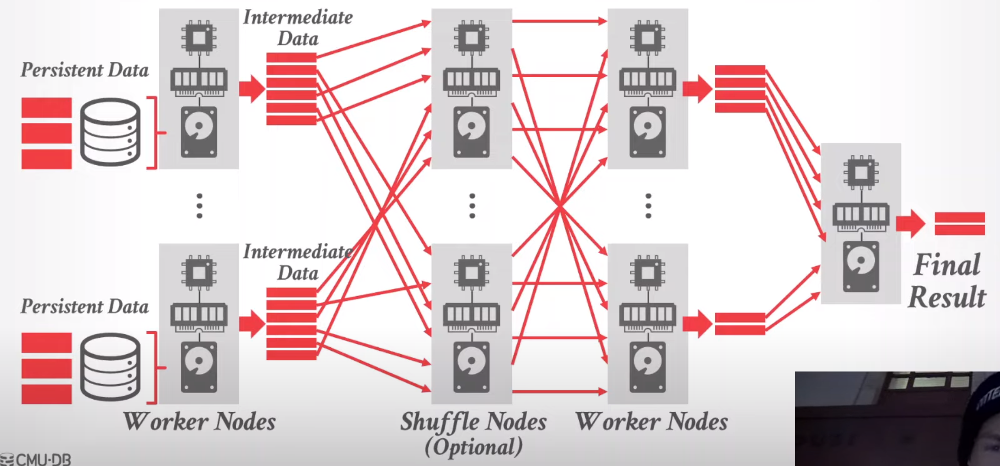

# CMU-15721

## 01

### 关系型数据库

### 面向对象的数据库

* JSON、XML

### OLAP数据库

* 在行存上做数据分析是一个bad idea
* 特点
  * 分布式/shared nothing
  * 关系型/SQL
  * 列存
  * Parallel column store data warehouse
* Mapreduce: hadoop hive spark(类似)

### NoSQL

* 目标：高可用、高扩展
* 特点：
  * Schemaless
  * Non-relational(document、 kv 、column-family)
  * No ACID transactions
  * Custom APIs instead of SQL
* hbase、 redis、 mongodb

### NewSQL

* 目标：在不放弃ACID的前提下，为OLTP负载提供与NoSQL相同的性能
* 特点：
  * 分布式
  * 关系型/SQL
* Google spanner、TiDB

### 云

* database-as-a-service、云原生
* snowflake

### Shared-DISK engines

* 云供应商管理存储
* 特点
  * 将执行层从存储中独立出来
  * favors log-structured approaches
* data lake

### 图系统

* 提供以图形为中心的查询API
* 2023年有文章验证了关系型数据库的性能可以超过图数据库（neo4j的10倍）

### 时序系统

* 为 时序数据 和 event data 设计
* 限定了 数据分布 和 查询模式
* Influxdb、clickhouse

### 区块链数据库

* Decentralized distributed log with incremental checksums (Merkle Trees)

## 02

### 分布式查询执行

在分布式DBMS中执行OLAP查询，与在单节点DBMS中执行OLAP查询大致相同

<figure><figcaption>
分布式查询执行示意图
</figcaption></figure>

**数据类别**

Persistent Data

* 源数据
* 一般不可以原地更新，而是append

Intermediate Data

* 中间数据
* 一个查询所产生的中间数据的数量与它所读取的持久性数据量或执行时间几乎没有任何关联
* 最好能存在内存

### 分布式结构 in OLAP

决定了数据存储位置。这将影响节点之间的协作方式，以及它们在数据库中检索/存储对象的位置

**两种方式**

1. Push Query to Data
   * 尽量将查询/计算下推到存储数据的节点
   * 在网络传输之前，在数据所在的节点尽可能多地进行过滤和处理
   * 在数据存储节点执行部分查询的代价 < 数据传输的代价
2. Pull Data to Query
   * 将数据带到正在执行查询的节点上
   * 这在数据存储节点上没有计算资源时，是必要的
   * 硬件发展迅速，网络加速，这也许是一个好方法

**Shared nothing**

* 每个数据库实例都拥有自己的cpu、内存、磁盘；相互之间通过网络进行通信
* 增加一个节点，需要在节点之间物理地移动数据
* dbms可以通过 POSIX API访问本地数据

**Shared disk**

* 每个节点都访问一个单一的逻辑磁盘，但是每个节点持有自己的cpu和内存
* Instead of a POSIX API, the DBMS accesses disk using a userspace API.

**比较**

* Shared nothing
  * 扩容难（需要移动数据）
  * 潜在的好性能和高效率
  * 在数据传输之前先过滤
* Shared disk（本课程后续主要关注对象）
  * 计算层扩展，可以独立于存储层
  * 容易关闭闲置的计算层资源
  * 可能需要在过滤之前，将持久数据从存储层拉到计算层
  * 云对象存储是现代OLAP DBMS的主流存储目标，因为可以“无限”扩展

**Object store**

* 将数据库的表（持久数据）分割成大的、不可改变的文件，存储在一个对象存储中
* 一个tuple的所有属性都以列存的方式存储在同一个文件中
* header包含列的偏移量、压缩方案、索引和区域图等元数据
* DBMS检索一个块的header以确定它需要检索哪些字节范围（只检索需要的小部分数据，不用读入整个块）
* Eg: Yellowbrick

**additional topics**

* file format
* table partitioning
* data ingestion/updates/discovery
* Scheduling/adaptivity

### OLAP组件

andy认为没必要从零开始实现一个数据库，分为组件并开源化是值得尝试的趋势

**SYSTEM CATALOGS**

跟踪数据库schema

* HCatalog、Google Data Catalog、Amazon Glue Data Catalog

**QUERY OPTIMIZERS**

基于启发式和基于成本的查询优化

* DBMS提供转换规则和成本估算
* framework返回一个逻辑或物理查询计划
* Greenplum Orca、 Apache Calcite

**FILE FORMATS**

大多数DBMS使用专有的磁盘上的二进制文件。这样的话，不同系统之间需要将数据转为通用的基于文本的格式，如：CSV、JSON、XML等

* Apache Parquet、Apache Iceberg、Apache ORC、HDF5、Apache Carbon Data、Apache Arrow

**EXECUTION ENGINES**

列存数据库上的向量化执行、流数据查询处理

* Velox、DataFusion、Intel OAP

## **03**

****

****

****

****

****

****

****

****

****

****

****
